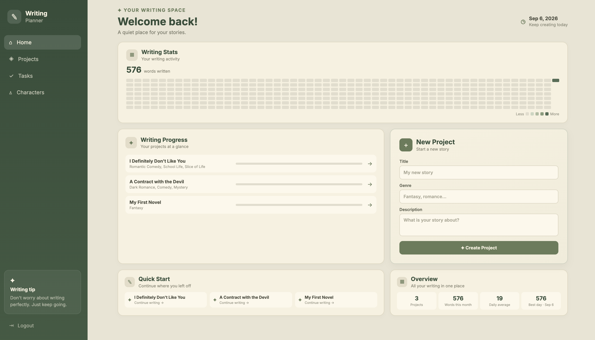
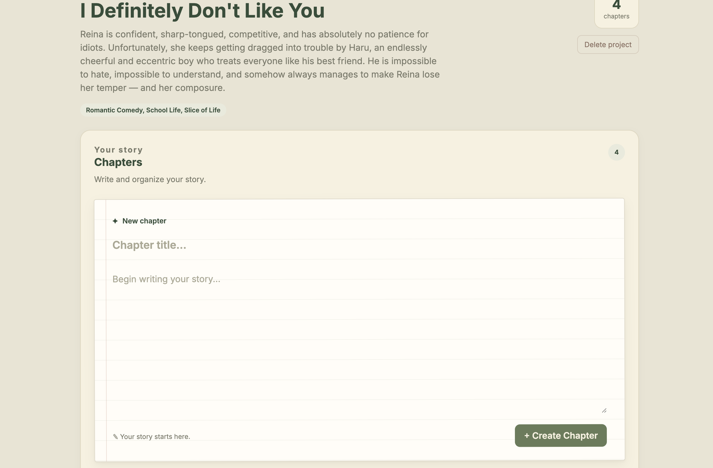

# ✎ Writing Planner

> A cozy writing workspace for organizing stories, chapters, characters, tasks, and writing progress.

[✦ Open Interactive Demo](https://mari-ww.github.io/writing-planner/demo/)

Writing Planner is a full-stack web application designed to give writers a simple and focused place to manage their stories and keep track of their writing activity.

The project was built as a portfolio application, with an emphasis on clean architecture, practical full-stack development, and a calm interface designed specifically for writers.

---

## ✨ Features

### 📚 Projects

Create and manage writing projects with:

- Title
- Description
- Genre
- Chapters
- Tasks
- Characters

Projects work as the main organizational space for each story.

### 📖 Chapters

Organize each story into chapters and write directly inside the application.

Each chapter includes:

- Title
- Content
- Word count
- Position/order
- Automatic writing activity tracking

Chapters can also be deleted when necessary.

### ✍️ Writing Tracking

The application automatically records writing activity when new words are added to chapters.

Writing history is aggregated across projects and displayed on the main dashboard.

### 📊 Writing Statistics

The dashboard provides a visual overview of writing activity, including:

- Total words written
- Writing activity over the last 365 days
- Words written this month
- 30-day daily average
- Best writing day

Writing activity is displayed as a GitHub-style contribution graph.

### ✅ Tasks

Tasks can be organized across projects, allowing writers to keep track of things that need to be completed.

### ♙ Characters

Characters are organized by project and can be viewed from a dedicated character section.

### 🗑️ Delete Management

Projects and chapters can be permanently deleted with confirmation before the action is performed.

---

## 🖥️ Demo

### Live Demo

[Open the interactive demo](https://mari-ww.github.io/writing-planner/demo/)

> This is a static visual demo created to provide a quick preview of the application's interface and user experience.

### 📸 Preview





---

## 📸 Preview

_Add screenshot_

<!--


-->

---

## 🛠️ Tech Stack

### Frontend

- React
- TypeScript
- Vite
- React Router

### Backend

- Python
- FastAPI
- SQLAlchemy
- Alembic
- PostgreSQL

### Infrastructure

- Docker
- Docker Compose

### Development

- Git
- GitHub
- Pytest

---

## 🏗️ Architecture

The application is divided into a frontend and backend that communicate through a REST API.

```text
┌──────────────────────┐
│      React App       │
│    TypeScript/Vite   │
└──────────┬───────────┘
           │
           │ REST API
           ▼
┌──────────────────────┐
│      FastAPI         │
│       Backend        │
└──────────┬───────────┘
           │
           ▼
┌──────────────────────┐
│     PostgreSQL       │
│      Database        │
└──────────────────────┘
```

The backend follows a layered structure to separate responsibilities between routes, services, repositories, models, and schemas.

The frontend is organized into pages, API modules, types, and styles.

---

## 📁 Project Structure

```text
writing-planner/
│
├── backend/
│   ├── app/
│   │   ├── models/
│   │   ├── repositories/
│   │   ├── routers/
│   │   ├── schemas/
│   │   └── services/
│   │
│   └── tests/
│
├── frontend/
│   └── src/
│       ├── api/
│       ├── pages/
│       ├── styles/
│       └── types/
│
├── demo/
│   ├── index.html
│   ├── demo.js
│   └── demo.css
│
├── docker-compose.yml
├── README.md
└── ...
```

---

## ⚙️ How It Works

### Creating a Project

A writer creates a project by providing its title and, optionally, its genre and description.

The project then becomes the central space for organizing the story.

### Writing a Chapter

A chapter belongs to a project and stores its title and content.

The application calculates the chapter's current word count from its content.

### Tracking Writing Activity

When a chapter is created or updated, the backend calculates how many words were added.

The writing activity is then recorded for the current day.

```text
Chapter created/updated
        ↓
Calculate word count
        ↓
Compare previous and new count
        ↓
Calculate words added
        ↓
Record daily writing activity
        ↓
Display statistics on Dashboard
```

This allows the dashboard to build a writing history across all projects.

### Dashboard Statistics

Writing history from each project is combined by date.

This allows the dashboard to display global writing statistics rather than limiting the data to a single story.

---

## 🚀 Running Locally

### Requirements

Make sure you have installed:

- Docker
- Docker Compose
- Node.js
- npm

### Clone the repository

```bash
git clone https://github.com/mari-ww/writing-planner.git
cd writing-planner
```

### Start the application

```bash
docker compose up --build
```

The application will start the required services using Docker Compose.

### Frontend

The frontend can then be accessed through the local development address configured by the project.

### API Documentation

FastAPI provides interactive API documentation through Swagger UI.

```text
/docs
```

---

## 🧪 Testing

The backend includes automated tests using Pytest.

Run the backend tests with:

```bash
pytest
```

The tests cover important application behavior, including writing tracking and API functionality.

---

## 🧠 What I Learned

Building Writing Planner helped me practice several aspects of full-stack application development:

- Designing a REST API with FastAPI
- Structuring a backend using services and repositories
- Working with PostgreSQL and SQLAlchemy
- Managing database changes with Alembic
- Building a React + TypeScript application
- Managing frontend API communication
- Designing reusable application pages and components
- Implementing automatic writing activity tracking
- Writing automated backend tests
- Using Docker to manage the development environment
- Designing an interface around a specific user workflow

---

## 🎨 Design

The interface was designed around the idea of creating a calm and focused writing environment.

The visual language uses:

- Warm cream backgrounds
- Sage green accents
- Rounded cards
- Soft borders
- Minimal visual noise
- Compact information sections

The goal is to make the application feel more like a personal writing workspace than a traditional productivity dashboard.

---

## 📌 Future Improvements

Possible future improvements include:

- [ ] More detailed writing analytics
- [ ] Custom daily writing goals
- [ ] Chapter progress indicators
- [ ] Drag-and-drop chapter ordering
- [ ] Rich text editing
- [ ] Character relationship visualization
- [ ] Exporting stories
- [ ] Deploy the full-stack application
- [ ] User profile customization

---

## 👩‍💻 Author

**Mariana**

Computer Science graduate focused on building practical full-stack applications with Python, React, and TypeScript.

---

## 📄 License

This project was created as a personal portfolio project.
